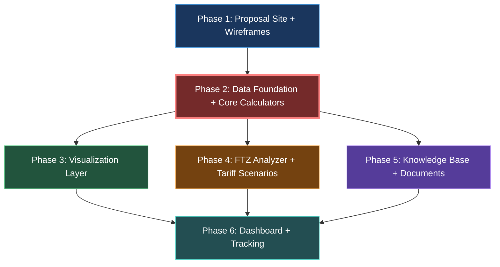

# Visual Architecture Plan — Shipping Logistics Platform

## System Architecture

```
┌─────────────────────────────────────────────────────────────────────────────┐
│                           BROWSER (Client)                                  │
│                                                                             │
│  ┌──────────────────┐  ┌──────────────────┐  ┌──────────────────────────┐  │
│  │  PROPOSAL SITE   │  │   CALCULATORS    │  │   MAP VISUALIZATION      │  │
│  │                  │  │                  │  │                          │  │
│  │  - Wireframes    │  │  - Landed Cost   │  │  react-map-gl            │  │
│  │  - Architecture  │  │  - Unit Econ     │  │    + MapLibre GL (free)  │  │
│  │  - Revenue Model │  │  - Container     │  │    + deck.gl layers:     │  │
│  │  - Platform Demo │  │  - Duty/Tariff   │  │      - ArcLayer (routes) │  │
│  │                  │  │  - FTZ Savings   │  │      - Scatter (ports)   │  │
│  │                  │  │                  │  │    + searoute-js          │  │
│  └──────────────────┘  └────────┬─────────┘  └────────────┬─────────────┘  │
│                                 │                          │                │
│                    ┌────────────┴──────────────────────────┘                │
│                    │                                                        │
│  ┌─────────────────┴──────────────────────────────────────────────────┐    │
│  │                    CALCULATION ENGINE (Pure TypeScript)              │    │
│  │                                                                      │    │
│  │  lib/calculators/                    State: Zustand + nuqs (URL)    │    │
│  │  ├── landed-cost.ts    ──┐                                          │    │
│  │  ├── unit-economics.ts   │── All use decimal.js                    │    │
│  │  ├── duty-tariff.ts      │── for financial precision               │    │
│  │  ├── ftz-savings.ts    ──┘                                          │    │
│  │  ├── container-utilization.ts                                       │    │
│  │  └── route-comparison.ts                                            │    │
│  └─────────────────────────────────┬──────────────────────────────────┘    │
│                                     │                                       │
│  ┌──────────────────────────────────┴──────────────────────────────────┐   │
│  │                    DASHBOARD (Recharts + @tremor/react)              │   │
│  │  - KPI Cards (cost/margin per shipment)                             │   │
│  │  - Cost breakdown charts (bar/pie)                                  │   │
│  │  - Route comparison tables (@tanstack/react-table)                  │   │
│  │  - FTZ savings timeline                                             │   │
│  └─────────────────────────────────────────────────────────────────────┘   │
│                                                                             │
└───────────────────────────────────┬─────────────────────────────────────────┘
                                    │
                                    │ API Routes (PDF generation only)
                                    │
┌───────────────────────────────────┴─────────────────────────────────────────┐
│                         NEXT.JS SERVER (Vercel)                             │
│                                                                             │
│  ┌─────────────────────┐  ┌─────────────────────┐  ┌──────────────────┐   │
│  │  /api/export/pdf    │  │  /api/hts/search     │  │  Server Components│   │
│  │  @react-pdf/renderer│  │  (FlexSearch index)  │  │  (data tables,   │   │
│  └─────────────────────┘  └─────────────────────┘  │   static content) │   │
│                                                      └────────┬─────────┘   │
│                                                               │             │
│  ┌────────────────────────────────────────────────────────────┴──────────┐  │
│  │                    STATIC DATA LAYER (/data/*.json)                    │  │
│  │                                                                        │  │
│  │  hts-schedule.json ─── Full HTS tariff schedule (USITC, free)         │  │
│  │  duty-rates-sea.json ─ SE Asia duty rates (Vietnam, Thailand, etc.)   │  │
│  │  ports.json ────────── 3,700+ ports (UN/LOCODE + World Port Index)    │  │
│  │  carrier-routes.json ─ Major SE Asia → US routes with transit times   │  │
│  │  ftz-locations.json ── 260+ FTZ zones (OFIS/trade.gov)               │  │
│  │  container-specs.json ─ 20ft, 40ft, 40ft HC, reefer dimensions       │  │
│  └────────────────────────────────────────────────────────────────────────┘  │
│                                                                             │
└─────────────────────────────────────────────────────────────────────────────┘

                    EXTERNAL DATA SOURCES (Phase 1: Downloaded, not live)
┌─────────────────────────────────────────────────────────────────────────────┐
│  USITC HTS API ──── hts.usitc.gov (FREE)                                   │
│  USITC DataWeb ──── dataweb.usitc.gov (FREE)                               │
│  OFIS FTZ DB ────── ofis.trade.gov (FREE)                                  │
│  UN/LOCODE ──────── unece.org (FREE)                                       │
│  World Port Index ─ NGA (FREE)                                             │
│  Maersk Schedules ─ developer.maersk.com (FREE, registration)              │
│  CMA CGM Schedules  api-portal.cma-cgm.com (FREE, registration)           │
│                                                                             │
│  PHASE 2+ (Paid):                                                           │
│  Terminal49 ─────── Container tracking (free tier: 100 containers)          │
│  Searoutes API ──── Maritime routing ($paid)                                │
│  MarineTraffic ──── AIS vessel tracking ($100+/mo)                          │
└─────────────────────────────────────────────────────────────────────────────┘
```

## Phase Dependency Graph



**Critical Path:** P1 → P2 → P3/P4 (parallel) → P6
**Parallel Opportunities:** P3 + P4 can run simultaneously after P2. P5 can run alongside P3/P4.

## Data Flow: Import Lifecycle

```
┌──────────┐    ┌──────────┐    ┌──────────┐    ┌──────────┐    ┌──────────┐
│  SOURCE   │───>│  SHIP    │───>│  CLEAR   │───>│  STORE   │───>│  FULFILL │
│  (SE Asia)│    │  (Ocean) │    │  (US CBP)│    │  (FTZ)   │    │  (3PL)   │
└──────────┘    └──────────┘    └──────────┘    └──────────┘    └──────────┘
     │               │               │               │               │
     ▼               ▼               ▼               ▼               ▼
┌──────────┐    ┌──────────┐    ┌──────────┐    ┌──────────┐    ┌──────────┐
│Unit Cost  │    │Freight   │    │Duty Rate │    │FTZ Rate  │    │Pick/Pack │
│$0.10/unit │    │$0.02/unit│    │6.5% HTS  │    │Lock @    │    │$0.15/unit│
│           │    │Container │    │ISF Filing │    │Entry Date│    │Ship to   │
│Quality    │    │Route     │    │MPF/HMF   │    │Withdraw  │    │Customer  │
│Inspection │    │Transit   │    │Exam Fees │    │Increments│    │           │
│Compliance │    │Insurance │    │Bond Cost │    │Savings   │    │           │
└──────────┘    └──────────┘    └──────────┘    └──────────┘    └──────────┘
     │               │               │               │               │
     └───────────────┴───────────────┴───────────────┴───────────────┘
                                     │
                              ┌──────┴──────┐
                              │ LANDED COST │
                              │ $0.50/unit  │
                              │             │
                              │ Wholesale:  │
                              │ $2.00/unit  │
                              │ Retail:     │
                              │ $5.00/unit  │
                              └─────────────┘
```

## Component Breakdown

| Component | Purpose | Inputs | Outputs | Dependencies |
|-----------|---------|--------|---------|--------------|
| **Proposal Site** | Communicate platform vision to partners/investors | Design specs, wireframes | Interactive Next.js website | None (Phase 1) |
| **HTS Lookup** | Search 100K+ tariff codes, show duty rates | Search term, country of origin | HTS code, duty rate, special rates | hts-schedule.json, Fuse.js |
| **Landed Cost Calculator** | Calculate total per-unit import cost | Unit cost, shipping, duty rate, fees | Per-unit landed cost, margin analysis | HTS Lookup (duty rates), container specs |
| **Unit Economics Calculator** | Model origin → retail value chain | Origin cost, landed cost, margins | Margin analysis at each stage | Landed Cost Calculator |
| **Container Calculator** | Optimize container utilization | Product dimensions, weight, qty | Units per container, utilization % | container-specs.json |
| **FTZ Savings Analyzer** | Model FTZ duty-locking strategy | Entry date, duty rates, withdrawal schedule | Savings over time, break-even | Duty/Tariff Calculator |
| **Route Comparison** | Compare carrier/route options | Origin port, destination port | 3 options with pricing tiers | carrier-routes.json, ports.json |
| **Shipping Route Map** | Visualize maritime routes on map | Route data, port coordinates | Interactive WebGL map | MapLibre, deck.gl, searoute-js |
| **Dashboard** | Aggregate KPIs across tools | All calculator outputs | Charts, tables, KPI cards | All calculators |
| **PDF Export** | Generate downloadable reports | Calculator results | PDF documents | @react-pdf/renderer, all calculators |
| **Knowledge Base** | SOPs for import process | Domain research | Searchable documentation | None (content-driven) |

## Calculator Data Dependencies

```
                    ┌─────────────────┐
                    │  HTS Schedule    │
                    │  (100K+ codes)   │
                    └────────┬────────┘
                             │
                    ┌────────┴────────┐
                    │  Duty/Tariff    │
                    │  Calculator     │
                    └────────┬────────┘
                             │
              ┌──────────────┼──────────────┐
              │              │              │
    ┌─────────┴───────┐ ┌───┴────────┐ ┌──┴──────────────┐
    │  Landed Cost    │ │  FTZ       │ │  Tariff Scenario │
    │  Calculator     │ │  Savings   │ │  Modeling         │
    └─────────┬───────┘ │  Analyzer  │ └──────────────────┘
              │         └────────────┘
    ┌─────────┴───────┐
    │  Unit Economics  │
    │  Calculator      │
    └─────────────────┘

    ┌─────────────────┐     ┌─────────────────┐
    │  Container       │     │  Route           │
    │  Calculator      │     │  Comparison      │
    │  (independent)   │     │  (independent)   │
    └─────────────────┘     └─────────────────┘
```
