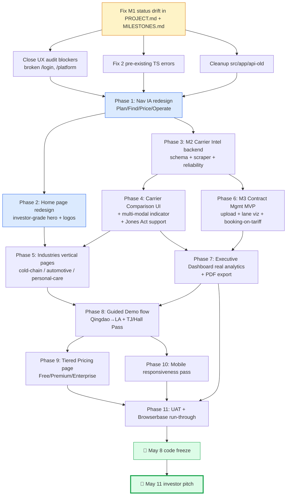

# Visual Plan — Milestone v1.1 Investor Demo Sprint

**Created:** 2026-04-22
**Investor pitch deadline:** 2026-05-11 (Las Vegas w/ Larry)
**Code freeze target:** 2026-05-08

---

## Step 1 — ASCII Architecture Map (target end-state)

```
                          ┌───────────────────────────────────────────┐
                          │           PUBLIC WEBSITE (/)              │
                          │   redesigned home — investor-grade hero   │
                          │   B2B positioning · multi-modal · cold    │
                          │   chain proof · Chiquita/Hall Pass logos  │
                          └──────────────┬────────────────────────────┘
                                         │
         ┌───────────────────┬───────────┼───────────────┬────────────────────┐
         │                   │           │               │                    │
    ┌────▼────┐         ┌────▼─────┐ ┌───▼────┐     ┌────▼─────┐       ┌──────▼──────┐
    │ /pricing│         │ /demo    │ │ /login │     │/industries│      │/jv-agreement│
    │ (tiers) │         │ (guided) │ │  /reg  │     │ (vertical │      │  (existing) │
    │ Free/Prm│         │ TJ + Qing│ │        │     │  demos)   │      │             │
    │ /Ent    │         │          │ │        │     │  NEW      │      │             │
    └─────────┘         └────┬─────┘ └───┬────┘     └───────────┘      └─────────────┘
                             │           │
                             │           │ auth
                             │           ▼
                             │     ┌─────────────────────────────────────────┐
                             │     │        PLATFORM SHELL (/platform)       │
                             │     │   NEW nav IA: grouped by job-to-be-done │
                             │     │   ┌──────────────────────────────────┐  │
                             │     │   │  Plan │ Find │ Price │ Operate   │  │
                             │     │   │       │      │       │           │  │
                             │     │   │  ▾    │  ▾   │  ▾    │  ▾        │  │
                             │     │   │  CARR │ PORT │ CALC  │ CONTR     │  │
                             │     │   │  ROUTE│ HTS  │ LANDED│ SHIPMENTS │  │
                             │     │   │  MULTI│ FTZ  │ TARIFF│ CROSS-DK  │  │
                             │     │   └──────────────────────────────────┘  │
                             │     └─────────────────────────────────────────┘
                             │                       │
            ┌────────────────┘                       │
            │                                        │
            ▼                                        ▼
   ┌─────────────────────────┐           ┌─────────────────────────────┐
   │   GUIDED DEMO FLOW      │           │   EXECUTIVE DASHBOARD       │
   │   (M4 core)             │           │   (real analytics, PDF)     │
   │   Step 1: Qingdao→LA    │           │   KPIs · shipments · spend  │
   │   Step 2: TJ/Hall Pass  │           │   carrier mix · on-time     │
   │   Step 3: Multi-modal   │           │   cold-chain vs general     │
   │   Step 4: FTZ + Tariff  │           │   export-to-PDF             │
   │   Step 5: Contracts     │           └─────────────────────────────┘
   │   Step 6: ROI summary   │
   └─────────────────────────┘
                             ┌────────────────────────────────────────────┐
                             │        M2 CARRIER INTELLIGENCE             │
                             │  ┌───────────────────────────────────────┐ │
                             │  │ Schedule Aggregator                   │ │
                             │  │  Maersk · MSC · CMA CGM · ONE · H-L   │ │
                             │  │  + Matson · Pasha Hawaii (Jones Act)  │ │
                             │  └────────┬──────────────────────────────┘ │
                             │           ▼                                 │
                             │  ┌───────────────────────────────────────┐ │
                             │  │ Port-to-port discovery + overlap      │ │
                             │  │ Reliability score (vsa-alliances.json │ │
                             │  │   + reliability.json + carrier-mkt)   │ │
                             │  │ Multi-modal indicator (ocean/rail/air │ │
                             │  │   /drayage)                           │ │
                             │  └───────────────────────────────────────┘ │
                             └────────────────────────────────────────────┘
                                         ▲
                                         │ reads/writes via Drizzle
                                         │
                             ┌────────────────────────────────────────────┐
                             │  M3 CONTRACT MGMT MVP                      │
                             │  Upload · digitize · lane visibility       │
                             │  Booking-on-tariff detection               │
                             │  Cross-dock facility tracking (concept)    │
                             └────────────────────────────────────────────┘
                                         ▲
                                         │
                             ┌────────────────────────────────────────────┐
                             │      NEON POSTGRES + DRIZZLE ORM           │
                             │  existing: orgs, users, calcs, audit,      │
                             │   hts_lookups, shipments, contracts        │
                             │  NEW: carriers, carrier_schedules,         │
                             │   carrier_reliability, lanes, cross_docks  │
                             └────────────────────────────────────────────┘
```

**Key shifts from today:**
- Sidebar IA flips from tool-type grouping (Calculators/Data/Settings) → **job-to-be-done grouping** (Plan/Find/Price/Operate). Puts carrier discovery + contract work on equal footing with calculators.
- Home page becomes investor-first marketing (was proposal-style with 6 calculators inline). Calculators move to `/platform/price/*` behind auth.
- NEW `/industries/*` routes for vertical demos (cold-chain / automotive / personal-care).
- NEW `/demo` guided flow drives investors through the two canonical stories (Qingdao→LA AND TJ/Hall Pass).

---

## Step 2 — Mermaid Dependency Graph



**Critical path:** A → E → G → H → K → L → O → P → Q
**Parallelizable:** Phases F (home) + I (industries) + J (contract mgmt) run alongside carrier intel.

---

## Step 3 — Component Breakdown Table

| Component | Purpose | Inputs | Outputs | Dependencies |
|---|---|---|---|---|
| **Nav IA redesign** | Replace `Sidebar.tsx` grouping with Plan/Find/Price/Operate sections | User role + current route | Rendered nav, active state, collapse state | RBAC permissions, existing icons |
| **Home page redesign** | Investor-grade marketing home replacing calculator-inline layout | None (static) | Hero, proof logos (Chiquita/Hall Pass), multi-modal strip, CTA to /demo + /pricing | Header, GradientButton, StatsBar |
| **Industries pages** | Vertical proof for cold-chain, automotive, personal-care | Route param (vertical) | Vertical-specific copy, relevant metrics, screenshots | Mock data per vertical |
| **Carrier Schedule Aggregator** | Scrape/ingest vessel schedules from 5 ocean carriers + 2 Jones Act | Cron trigger | carrier_schedules rows | Cheerio scraper, Drizzle, Neon |
| **Carrier Reliability Scoring** | Compute score from VSA alliances + historical on-time | carrier_schedules, vsa-alliances.json | carrier_reliability rows | Existing `data/reliability.json` as seed |
| **Port-to-port discovery** | "Show me all carriers running QINGDAO → LONG BEACH" | origin port, dest port | Ranked carrier list w/ transit, reliability, mode | Carrier schedule data |
| **Multi-modal indicator** | Tag each option with ocean/rail/air/drayage icon | Carrier route metadata | Rendered badge + filter | Route data schema extension |
| **Contract upload** | Accept PDF, extract lanes + rates + term | Uploaded PDF | Parsed contract stored in DB | Claude vision, contracts table |
| **Lane visibility** | Show which lanes are under contract vs spot | Contracts + shipments | Dashboard widget | Contract Mgmt + Exec Dashboard |
| **Booking-on-tariff detection** | Flag shipments booked off-contract when contract covers lane | Shipments + contracts | Alert list | Lane parser |
| **Executive Dashboard analytics** | Real KPIs (not mock) from DB | org_id, date range | KPI cards + charts (Recharts) | Drizzle queries, existing layout |
| **PDF export** | Export dashboard + demo summaries to PDF | Dashboard snapshot | Downloadable PDF | react-pdf or puppeteer |
| **Guided Demo flow** | Step-through investor story | None (guided sequence) | 6-step narrative with live calc results | All M2/M3 components |
| **Tiered Pricing page** | Free / Premium / Enterprise with per-user bundles (8 / 20 / unlimited) | None (static) | Marketing page + CTA | Home page design system |
| **Mobile responsiveness pass** | Audit + fix all routes under 768px | All existing pages | Fixed layouts | Tailwind, QA pass |
| **UAT + Browserbase run-through** | End-to-end smoke of demo flow | Live preview URL | Pass/fail report per step | Browserbase (currently offline — fallback: Playwright CLI) |

---

## Step 4 — Scope Lock

**IN (v1.1 Investor Demo Sprint):**
- All M2 Carrier Intel targets
- All M3 Contract Mgmt MVP targets
- All M4 Investor Demo targets
- NEW: Nav IA redesign (Plan/Find/Price/Operate)
- NEW: Home page redesign (investor-grade)
- NEW: Industries vertical pages (cold-chain/automotive/personal-care)
- Housekeeping: M1 status drift fix, TS errors, api-old cleanup, UX audit blockers

**OUT (defer to M5 Post-Investment):**
- Live AIS vessel tracking
- Geopolitical alerts
- NVOCC white-label portal
- Advertiser/sponsor integration for free tier
- Real carrier API partnerships (stay on scraping + seeded data for demo)

---

## Step 5 — Open Questions for Julian

Before I write PROJECT.md and route to requirements/roadmap, I need your direction on:

1. **Nav grouping** — is "Plan / Find / Price / Operate" the right spine? Or do you want something else (e.g. by persona: Shipper / Broker / Ops)?

2. **Home page direction** — is the goal:
   - (a) **Investor-facing landing** (no calculators, just story + proof + CTA to book demo), OR
   - (b) **Customer-facing B2B marketing** (for NVOCCs + enterprise shippers), OR
   - (c) **Both** — single page that serves both audiences?

3. **Industries pages** — which verticals matter most for May 11? Cold-chain is a given. Add automotive + personal-care? Or also add general cargo / Jones Act / Chiquita ex-works?

4. **Contract upload** — OK to use Claude vision to parse PDFs for M3, or do you want a manual form as the MVP?

5. **Pricing page** — confirm tiers: Free (with ads/credits) / Premium / Enterprise, user bundles at 8 / 20 / unlimited — match what Blake said April 7?

6. **Milestone name** — `v1.1 Investor Demo Sprint` OK? Or prefer `v2.0 Demo Ready` / something else?

---

**STOP. Waiting for your answers to 1–6 before I update PROJECT.md / STATE.md / MILESTONES.md and route to `/gsd:define-requirements`.**
