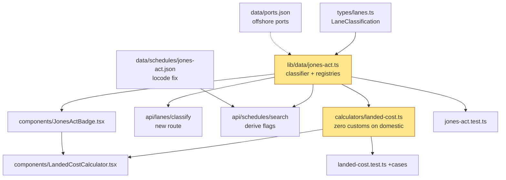

# AI-12014 — Jones Act lane support (Matson / Pasha)

> Blake's ask: *"Just like we can't compare Del Monte to Maersk, we need to signify
> Jones Act vs non-Jones Act carriers."* Plus no-customs-import flagging for the
> AK / HI / PR domestic lanes.

## 1. Architecture map

```
                          ┌──────────────────────────────────────┐
                          │  src/lib/data/jones-act.ts   (NEW)   │
                          │  ── canonical lane classifier ──     │
                          │  • JONES_ACT_CARRIERS (Matson,       │
                          │    Pasha, TOTE, Crowley, …)          │
                          │  • DOMESTIC_OFFSHORE_PORTS           │
                          │    (HI / AK / PR / USVI / GU)        │
                          │  • US customs-territory membership   │
                          │  • classifyLane(o, d, carrier)       │
                          └───────────────┬──────────────────────┘
                                          │ LaneClassification
              ┌───────────────────────────┼───────────────────────────┐
              │                           │                           │
              ▼                           ▼                           ▼
┌───────────────────────┐   ┌──────────────────────────┐   ┌────────────────────────┐
│ landed-cost.ts        │   │ /api/lanes/classify      │   │ /api/schedules/search  │
│ (MODIFIED)            │   │ (NEW route)              │   │ (MODIFIED)             │
│ customsEntryRequired  │   │ GET ?origin&destination  │   │ derives is_jones_act / │
│  === false  ⇒         │   │     &carrier             │   │ customs_required from  │
│  duty = MPF = HMF = 0 │   │ → LaneClassification     │   │ the classifier when    │
│  broker fee  = 0      │   │                          │   │ the JSON omits them    │
│  + result.lane {...}  │   └──────────────────────────┘   └────────────────────────┘
└──────────┬────────────┘
           │ result.lane
           ▼
┌──────────────────────────────┐        ┌───────────────────────────────┐
│ LandedCostCalculator.tsx     │───────▶│ JonesActBadge.tsx  (NEW)      │
│ (MODIFIED) domestic banner,  │        │ "Jones Act · Domestic (HI)"   │
│ carrier select, no-duty note │        │ "International import"        │
└──────────────────────────────┘        └───────────────────────────────┘

DATA FIXES
  data/schedules/jones-act.json  USPEV → USPEF, PRSJN → PRSJU  (locode drift)
  data/ports.json                + USOGG USITO USLIH USKDK USDUT USHUE
```

## 2. Dependency graph



Critical path: `types/lanes.ts → jones-act.ts → landed-cost.ts → UI`.
Parallel: data fixes, `/api/lanes/classify`, schedules-search derivation, badge component.

## 3. Component breakdown

| Component | Purpose | Inputs | Outputs | Dependencies |
|---|---|---|---|---|
| `src/lib/types/lanes.ts` | Shared `LaneClassification` / `JonesActTrade` types (no runtime dep, avoids import cycle) | — | types | none |
| `src/lib/data/jones-act.ts` | Carrier registry + port/trade tables + `classifyLane()` | origin locode, dest locode, carrier name/code | `LaneClassification` | `types/lanes.ts` |
| `src/lib/calculators/landed-cost.ts` | Suppress duty / MPF / HMF / broker on non-import lanes; expose `result.lane` | `LandedCostInput` (+ optional `carrier`, `domesticLaneOverride`) | `LandedCostResult` w/ `lane` | `jones-act.ts` |
| `src/app/api/lanes/classify/route.ts` | HTTP surface for the classifier | `?origin&destination&carrier` | JSON classification | `jones-act.ts` |
| `src/app/api/schedules/search/route.ts` | Fill `is_jones_act` / `customs_required` for every schedule, not just hand-tagged ones | query params | schedules w/ flags | `jones-act.ts` |
| `src/components/JonesActBadge.tsx` | Visual "signify" element Blake asked for | `LaneClassification` | badge JSX | `types/lanes.ts` |
| `src/components/LandedCostCalculator.tsx` | Carrier field + domestic-lane banner + duty suppression note | user input | UI | badge, landed-cost |
| `data/schedules/jones-act.json` | Fix `USPEV`→`USPEF`, `PRSJN`→`PRSJU` so schedules join the ports dataset | — | data | — |
| `data/ports.json` | Add missing Jones Act offshore ports | — | data | — |

## 4. Regulatory rules encoded

| Trade lane | Jones Act (coastwise) | Inside US customs territory | CBP entry / duty |
|---|---|---|---|
| Mainland ↔ Hawaii | yes | yes | **no** |
| Mainland ↔ Alaska | yes | yes | **no** |
| Mainland ↔ Puerto Rico | yes | yes | **no** |
| Mainland ↔ Guam | yes | **no** | yes |
| Mainland ↔ USVI | **exempt** | **no** | yes |
| Mainland ↔ Am. Samoa / CNMI | **exempt** | no | yes |
| International → US | n/a | n/a | yes |

Suppressing duty + MPF + HMF + broker only where `customsEntryRequired === false`
keeps Guam/USVI honest instead of blanket-zeroing everything that touches a US flag.
