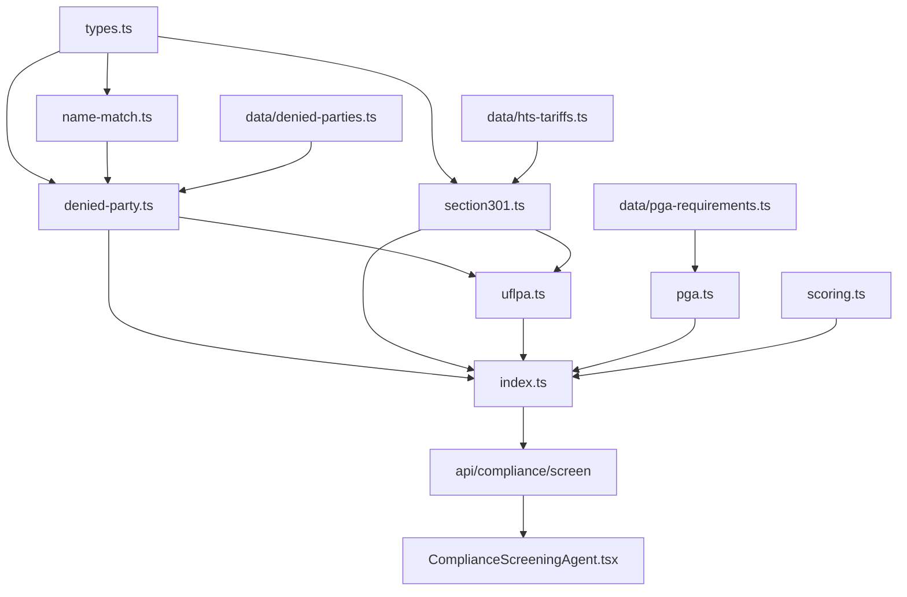

# Visual Plan — AI-12017 Compliance Screening Agent

Score a shipment before it departs and block the non-compliant ones, so a
$10K–$100K hold never happens on the US side of the ocean.

## Architecture

```
UI                                API                             ENGINE (pure, testable)
ComplianceScreeningAgent.tsx ──▶  POST /api/compliance/screen ──▶  screenShipment()  (src/lib/compliance)
  party table                       auth() gate                      name-match.ts    Jaro-Winkler + token set
  invoice line table                zod validation                   denied-party.ts  SDN / Entity List / jurisdictions
  departure date                    server-set evaluationDate        section301.ts    duty + origin-pivot detection
  verdict + exposure                400 on guard errors              uflpa.ts         Entity List, XUAR nexus, sectors
  findings / agency routing                                          pga.ts           HTS -> agency + lead time
  action plan                                                        scoring.ts       score, verdict, exposure model
                             GET /api/compliance/parties ──▶         index.ts         orchestrator + guards
                               single-name lookup

DATA: lib/data/denied-parties.ts   seed lists + data/denied-parties.json loader
      lib/data/pga-requirements.ts HTS chapter/heading/keyword -> agency filing
      lib/data/hts-tariffs.ts      SECTION_301_RATES (shared with landed cost)
```

## Dependency graph



## The four screens

| Screen | Blocks when | Warns when | Authority |
|---|---|---|---|
| Denied party | probable-or-better name match on any list | possible match (78–85%) | 31 CFR Ch. V; 15 CFR 744 |
| Sanctioned jurisdiction | comprehensive embargo or restricted region | targeted programme | EO / CFR per programme |
| Section 301 | never — duty is a cost, not a hold | exclusion claimed; origin pivot detected | 19 USC 2411; 19 USC 1592 |
| UFLPA | Entity List match or XUAR nexus | high-priority sector, no traceability | UFLPA; 19 USC 1307 |
| PGA routing | mandatory filing already past its lead time | mandatory filing missing, still in time | per agency |

## Decisions worth keeping

- **No LLM in this path.** A hallucinated "no match" on a sanctions screen is a
  strict-liability violation. Everything is arithmetic and table lookups.
- **Verdict is driven by findings, never by the score.** One blocking finding is
  BLOCKED at any score. The score triages a queue; the verdict decides a box.
- **Coverage travels with the result.** "No hits" against a 20-name seed list is
  not the statement "no hits" against the consolidated list. The result carries
  `coverage.seedData` and the UI prints the caveat next to the verdict.
  `npm run load:denied-parties` replaces the seed and removes the caveat.
- **Guards throw, they do not clamp or skip.** A screen that silently drops the
  one party it could not parse returns a clean result for a shipment nobody
  screened — the exact failure this agent exists to prevent.
- **Penalty exposure only attaches where origin is in question.** Correctly
  declaring a 301 rate is a cost. Modelling it as a penalty would inflate every
  China shipment until the number stopped meaning anything.
- **No urgency without a date.** A missing departure date reports lead times
  without a deadline rather than inventing one.

## Verification

- 66 unit tests (721 total across 32 files, all green)
- `tsc --noEmit` clean
- `next build` clean, all three new routes emitted
