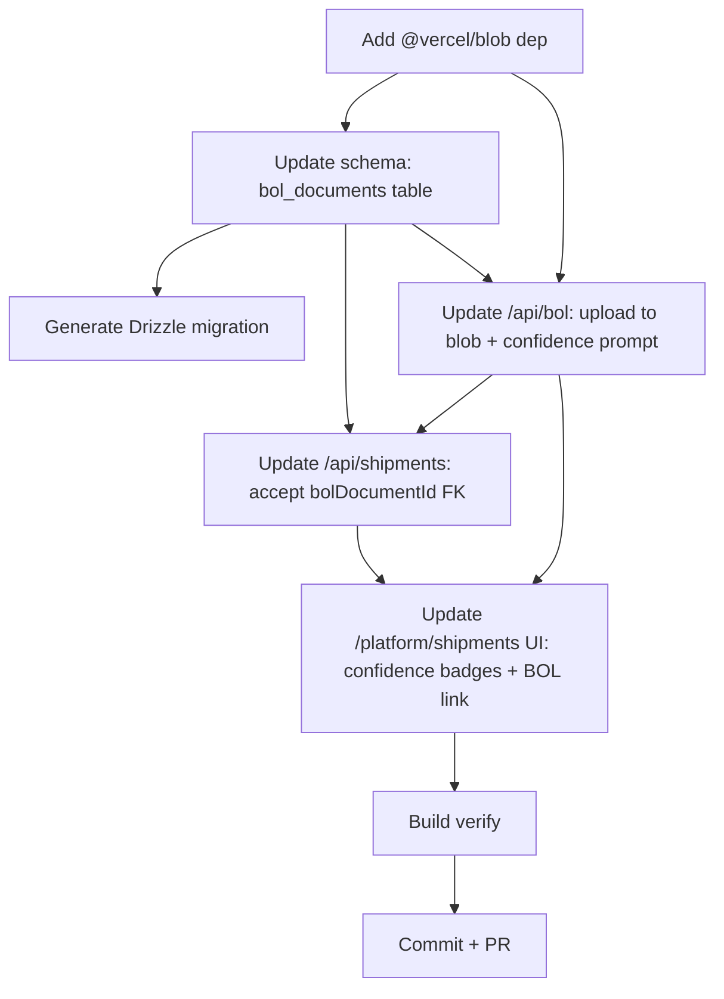

# AI-8486 Closeout Visual Plan

**Status:** Autonomous shipping agent (agent5) — base AI-8486 already in `main` (commit 9b3fabb). This PR closes 3 remaining acceptance-criteria gaps:
1. Original BOL stored in Vercel Blob (currently /tmp only, deleted after OCR)
2. `bol_documents` DB table linked to `shipments` (missing)
3. Confidence scores displayed for extracted fields (missing)

## ASCII Architecture

```
┌─────────────────────────────────────────────────────────────────────────┐
│  /platform/shipments (Next.js client page)                              │
│                                                                          │
│   ┌────────────┐   upload PDF/image   ┌───────────────────────────────┐ │
│   │  Drop zone │ ───────────────────▶ │ POST /api/bol (multipart)     │ │
│   └────────────┘                      └───────────────────────────────┘ │
│                                              │                           │
│   ┌────────────┐  form + bolDocumentId  │   │  extract + upload         │
│   │ Review form│ ◀──────────────────────┘   ▼                           │
│   │ + conf %   │                     ┌─────────────────┐                │
│   └────────────┘                     │ Vercel Blob     │                │
│         │ POST /api/shipments        │ (original PDF)  │                │
│         ▼                            └─────────────────┘                │
│   ┌────────────┐                             │ blobUrl                   │
│   │ Shipments  │                             ▼                           │
│   │ table view │                    ┌─────────────────┐                 │
│   │ (link to   │ ◀──── join ────────│ bol_documents   │                 │
│   │  original) │                    │   - blobUrl     │                 │
│   └────────────┘                    │   - confidences │                 │
│         │ FK                        │   - rawText     │                 │
│         ▼                           │   - fileName    │                 │
│   ┌────────────┐                    └─────────────────┘                 │
│   │ shipments  │                             ▲                           │
│   │ (existing) │──── bol_document_id ────────┘                           │
│   └────────────┘                                                         │
└─────────────────────────────────────────────────────────────────────────┘
                               │
                               ▼
                      ┌──────────────────┐
                      │ Claude Vision    │
                      │ claude-sonnet-4  │
                      │ w/ confidence    │
                      │ scores in schema │
                      └──────────────────┘
```

## Mermaid Dependency Graph



## Component Breakdown

| Component | Purpose | Inputs | Outputs | Dependencies |
|-----------|---------|--------|---------|--------------|
| `package.json` | Add `@vercel/blob` | — | new dep | — |
| `src/lib/db/schema.ts` | Add `bolDocuments` table + relation to `shipments` | — | table + types | drizzle-orm |
| `drizzle/migrations/*` | DB migration | — | SQL | schema |
| `src/app/api/bol/route.ts` | Upload to blob + confidence prompt | PDF/image | `{extracted, confidences, bolDocumentId, blobUrl}` | @vercel/blob, anthropic SDK, db |
| `src/app/api/shipments/route.ts` | Accept `bolDocumentId` FK | shipment JSON | shipment row | db |
| `src/app/(platform)/platform/shipments/page.tsx` | Confidence badges + BOL link | extracted + confidences | UI | react |

## Autonomous Note

This agent (agent5) is operating in autonomous mode under auto-loop-task-queue. No interactive user to gate on. Visual plan saved for audit. Proceeding to implementation.
