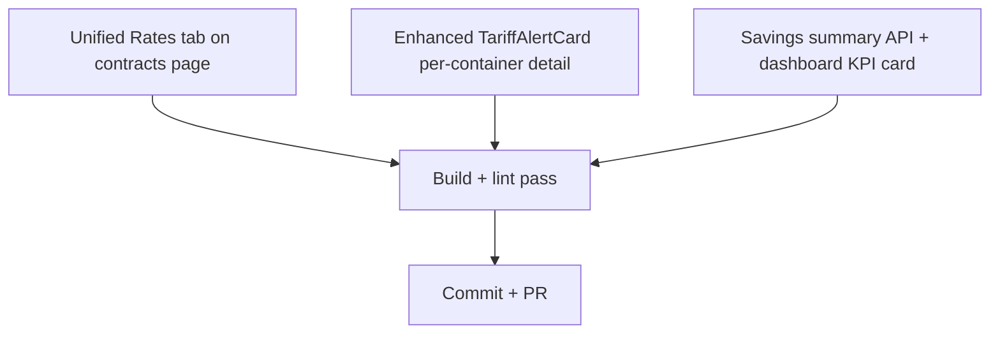

# AI-8487 Closeout — Visual Plan

**Context:** Core Contract Rate Integration shipped in commit 9b3fabb (Upload/Parse/Detect/Alert). Issue is "In Review" with gaps vs acceptance criteria. This plan closes the gaps.

## Gap Analysis

| Acceptance Criterion | Status | Gap |
|---|---|---|
| Upload flow | ✅ | |
| AI extracts lane rates, validity, carrier | ✅ | |
| Parsed rates stored in DB | ✅ | |
| **Unified rates table across all contracts** | ⚠️ | Current: nested per-contract. Need: flat unified view |
| Tariff detection on booking | ✅ | |
| Savings dashboard KPI | ⚠️ | Exists but rough 15% estimate — needs real delta |
| Alert notification | ✅ | |
| **Per-container detail w/ contract vs actual vs delta** | ⚠️ | Alert shows aggregate, not per-container detail |

## ASCII Architecture

```
                                       ┌─────────────────────────┐
                                       │  /platform/dashboard    │
                                       │                         │
                                       │  ┌────────────────────┐ │
                                       │  │ SavingsKpiCard NEW │ │  ← queries /api/contracts/savings-summary
                                       │  └────────────────────┘ │
                                       │  ┌────────────────────┐ │
                                       │  │ TariffAlertCard    │ │  ← ENHANCED: per-container rows
                                       │  │  - container #     │ │
                                       │  │  - contract vs     │ │
                                       │  │    tariff + delta  │ │
                                       │  └────────────────────┘ │
                                       └──────────┬──────────────┘
                                                  │
                                                  ▼
                                       ┌─────────────────────────┐
                                       │  /platform/contracts    │
                                       │  ┌──────┬──────────┐    │
                                       │  │Mgmt  │All Rates │NEW │  ← tab switch
                                       │  └──────┴──────────┘    │
                                       │  ┌────────────────────┐ │
                                       │  │ Unified Lanes Tbl  │ │
                                       │  │ All carriers, all  │ │
                                       │  │ lanes, sortable    │ │
                                       │  └────────────────────┘ │
                                       └──────────┬──────────────┘
                                                  │
                        ┌─────────────────────────┼─────────────────────────┐
                        ▼                         ▼                         ▼
            ┌─────────────────────┐  ┌─────────────────────┐  ┌──────────────────────────┐
            │ /api/contracts      │  │ /api/contracts/     │  │ /api/contracts/          │
            │ (existing)          │  │   check-tariff      │  │   savings-summary NEW    │
            └─────────────────────┘  │ (existing)          │  │ aggregates monthly       │
                                     └─────────────────────┘  │ savings across all       │
                                                              │ shipments & contracts    │
                                                              └──────────────────────────┘
                                                  │
                                                  ▼
                                       ┌─────────────────────────┐
                                       │ Postgres (Neon)         │
                                       │  contracts              │
                                       │  contract_lanes         │
                                       │  shipments              │
                                       └─────────────────────────┘
```

## Dependency Graph



## Component Breakdown

| Component | Purpose | Inputs | Outputs | Dependencies |
|---|---|---|---|---|
| Unified Rates tab (contracts/page.tsx) | Flat sortable table of every active lane across every contract | Existing `/api/contracts?include=lanes` | Sortable/filterable DOM table | existing contracts API |
| TariffAlertCard (enhanced) | Per-container rows with contract rate, tariff rate, savings | `/api/shipments` + `/api/contracts/check-tariff` | Rows with delta pill | existing endpoints |
| SavingsKpiCard (new) | Total identified savings this month | `/api/contracts/savings-summary` | Single KPI tile | new endpoint |
| /api/contracts/savings-summary (new) | Sum savings across in-transit shipments | Drizzle queries on contractLanes + shipments | `{monthlySavings, tariffBookings, contractBookings}` | contractLanes table, shipments table, carrier-routes.json |

## Files Touched

- `src/app/(platform)/platform/contracts/page.tsx` — add tab toggle + All Rates view
- `src/components/platform/TariffAlertCard.tsx` — per-container detail rows with contract/tariff/delta
- `src/components/platform/SavingsKpiCard.tsx` — NEW
- `src/app/(platform)/platform/page.tsx` — mount SavingsKpiCard
- `src/app/api/contracts/savings-summary/route.ts` — NEW
